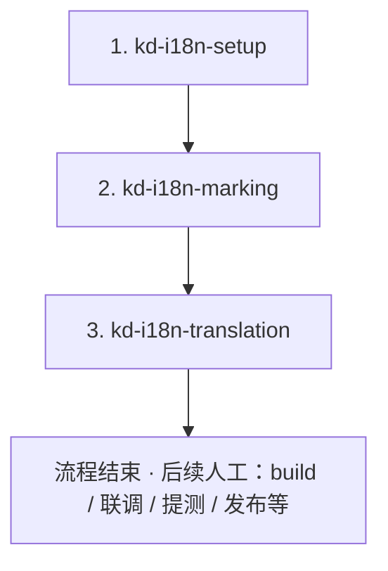

# KD 国际化工作流 (kd-i18n)

本 Skill 提供公司内部基于 **VoerkaI18n** 的标准化国际化解决方案，专为大型 Vue 2 项目设计。

## 适用场景

- 需要在现有 Vue 2 项目中引入或完善国际化
- 项目文件较多，需避免 AI 上下文过载
- 需要处理多语言文本长度差异和 RTL（阿拉伯语）样式问题
- 希望遵循统一、可复用的国际化开发流程

## 子 Skill 列表

使用以下子 Skill 完成对应环节（推荐按顺序使用）：

1. **[kd-i18n-setup](../kd-i18n-setup/)** - 项目初始化、依赖安装、VoerkaI18n 配置
2. **[kd-i18n-marking](../kd-i18n-marking/)** - **智能文本标注**（重点优化大项目场景）
3. **[kd-i18n-translation](../kd-i18n-translation/)** - 翻译与 **`pnpm i18n:compile`**（详见该 Skill）

## 整体工作流程（简化版）

> **注意**：**`voerkai18n compile`** 已纳入 **kd-i18n-translation**（`pnpm i18n:compile`）。**无 kd-i18n-styling 环节**；文本长度、RTL 布局与页面验收由业务在工程中自行处理。

## 使用方法

当遇到以下情况时，自动调用对应子 Skill：

- "帮我初始化国际化" → 使用 `kd-i18n-setup`
- "如何提取翻译文本" 或 "文本标注" → 使用 `kd-i18n-marking`
- "翻译流程" 或 "如何管理翻译" → 使用 `kd-i18n-translation`

---

**顺序**：setup → marking → translation（含 compile）→ **完结**。请告知当前处于哪一环节，以便调用对应 Skill。
