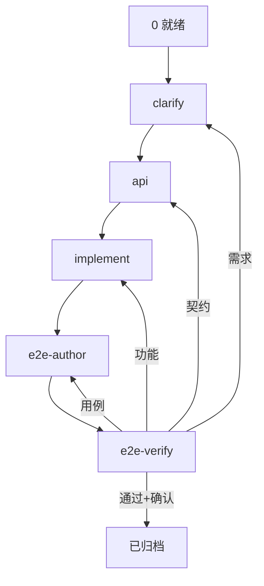

# yun-reqflow

只调度与门禁；细节在子 Skill。

| # | Skill | 出口 |
|---|--------|------|
| 1 | [yun-reqflow-clarify](../yun-reqflow-clarify/) | `已确认` |
| 2 | [yun-reqflow-api](../yun-reqflow-api/) | 保持已确认 |
| 3 | [yun-reqflow-implement](../yun-reqflow-implement/) | 用户确认 → `已处理` |
| 4 | [yun-reqflow-e2e-author](../yun-reqflow-e2e-author/) | specs 落盘（无脚手架先装） |
| 5 | [yun-reqflow-e2e-verify](../yun-reqflow-e2e-verify/) | 用户确认 → `已归档` |

## 门禁

1. 先读 `req_docs` 的 `status`（或问用户），从对应子 Skill 续，不重跑已完成阶段。  
2. 未授权不改代码；不擅自 `已处理` / `已归档`。  
3. 强依赖接口未对齐：不进 implement（用户明示 mock/延期除外）。  
4. 中文；`req_docs` 只写结论；**已归档文档与 e2e specs 均保留**。

## Step 0

1. 有本仓 `vue.custom.js` → Read [references/kd-fe-config.md](references/kd-fe-config.md)，输出快照表。  
2. Read [references/project-readiness.md](references/project-readiness.md)。  
3. 确认当前阶段。

状态：`草稿` → `已确认` → `已处理` → `已归档`（后两态须用户确认）。
